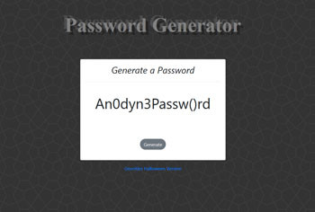

# Password-Generator

This project includes html, css, and javascript files that together create a password generator that delivers a final password of between 8-120 characters. 

Users are prompted to include special characters, uppercase letters, lowercase letters, and/or numbers, and to input a number into the prompt field.

This project practiced event listeners, function expressions, do/while loops, if/if else/else statements, alerts, prompts, and DOM methods. 

## Appearance

This project was completed as part of the fall 2020 MSU/Trilogy 6-month bootcamp, so I’ve included an anodyne display (index.html) for grading purposes. 

I’ve also included a version (halloweenGeocitiesPasswordGenerator.html) gwith a different appearance to liven things up. (It’s almost October.) The html file name gives some hints as to the visual theme. 

### Original Assignment

03 JavaScript: Password Generator
Create an application that generates a random password based on user-selected criteria. This app will run in the browser and feature dynamically updated HTML and CSS powered by your JavaScript code. It will also feature a clean and polished user interface and be responsive, ensuring that it adapts to multiple screen sizes.
If you are unfamiliar with special characters, take a look at some examples.

User Story
AS AN employee with access to sensitive data
I WANT to randomly generate a password that meets certain criteria
SO THAT I can create a strong password that provides greater security

Acceptance Criteria
GIVEN I need a new, secure password
WHEN I click the button to generate a password
THEN I am presented with a series of prompts for password criteria
WHEN prompted for password criteria
THEN I select which criteria to include in the password
WHEN prompted for the length of the password
THEN I choose a length of at least 8 characters and no more than 128 characters
WHEN prompted for character types to include in the password
THEN I choose lowercase, uppercase, numeric, and/or special characters
WHEN I answer each prompt
THEN my input should be validated and at least one character type should be selected
WHEN all prompts are answered
THEN a password is generated that matches the selected criteria
WHEN the password is generated
THEN the password is either displayed in an alert or written to the page